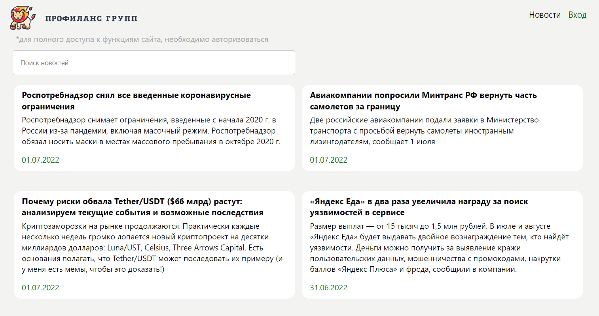

## React_ProfilanceGroup_Test

## Новостной портал

Данный проект позволяет: просматривать, предлагать и редактировать новости. Незарегистрированный пользователь обладает правами только на просмотр новости. Зарегистрированный пользователь имеет расширенный функционал, позволяющий предложить новость. Администратор имеет возможность модерировать (одобрить/удалить) новости.

## Тестовые пользователи: 

- Admin:  Логин: admin Пароль: admin
- User:  Логин: user Пароль: user

## Хостинг

Проект развернут на площадке google Firebase

https://reactprofilancegroup.firebaseapp.com/

## Технологический стек:
- React
- Redux
- Redux-persist
- БЭМ и SASS/SCS

## Зависимости:
- "firebase": "^9.9.0"
- "firebase-tools": "^11.2.1"
- "node-sass": "^7.0.1"
- "react": "^18.2.0"
- "react-dom": "^18.2.0"
- "react-redux": "^8.0.2"
- "react-router-dom": "^6.3.0"
- "react-scripts": "5.0.1"
- "redux": "^4.2.0"
- "redux-devtools-extension": "^2.13.9"
- "redux-persist": "^6.0.0"
- "web-vitals": "^2.1.4"
